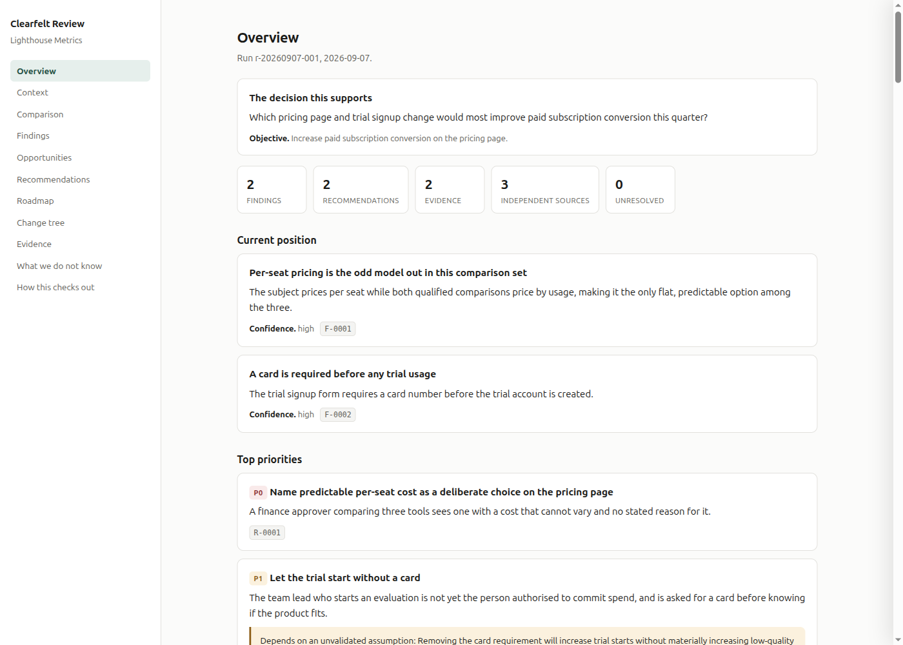
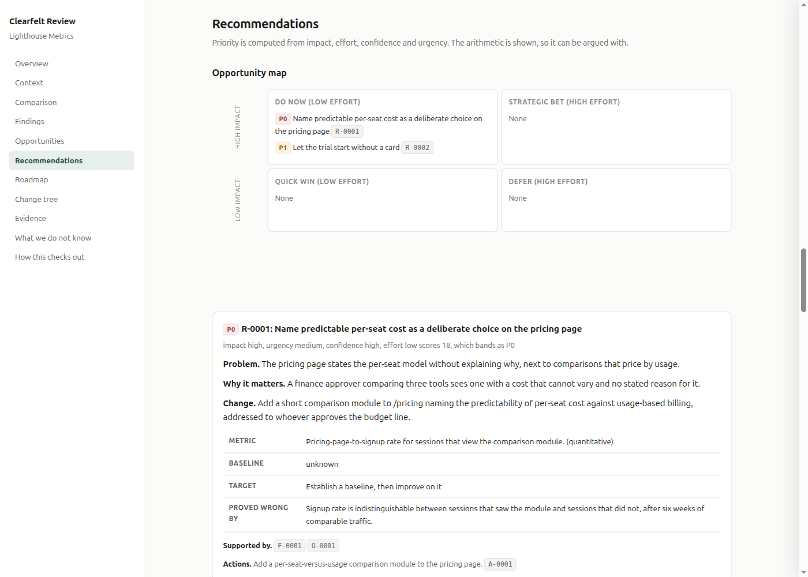

# Clearfelt Review

[](https://github.com/andrei-ionut-nita/clearfelt-review/actions/workflows/ci.yml)
[](https://github.com/andrei-ionut-nita/clearfelt-review/releases)
[](LICENSE)
[](package.json)

**Ask an AI research tool "why?" and it hands you a paragraph. Ask this one, and it hands you a receipt.**

Say a review recommends this, for a SaaS company called Lighthouse Metrics:

> Let the trial start without a card.

Reasonable-sounding advice. Also the kind of line an AI audit tool will happily generate about a product it has never opened, because nothing forces it to point at where that claim came from. Ask this one to show its work, and it does, all the way down to a real HTML form on a real page:

```
$ clearfelt-review trace reviews/lighthouse-metrics/r-20260907-001 R-0002

R-0002  Let the trial start without a card
├── F-0002  [derived] A card is required before any trial usage.
│   └── E-0002  A prospective user must provide a card number before the trial account exists.
│       └── OBS-0004  The trial signup form requires a card number before the trial account is created.
│           └── S-0001  https://lighthouse-metrics.example/pricing
└── O-0002  A card-free trial removes a procurement step from evaluation
    └── ...
```

Every arrow is a real link, not a summary of one: the recommendation cites the finding, the finding cites the evidence, the evidence cites the observation, the observation cites the page it was read off. Follow it to the bottom and you land on `form#trial-signup input[name=card_number]`, not on "trust me".

It runs in reverse too, so you can start from a source and ask what it actually changed:

```
$ clearfelt-review trace reviews/lighthouse-metrics/r-20260907-001 S-0001 --reverse
```

## See it for yourself

Lighthouse Metrics isn't invented for this README. It's `fixtures/commercial-saas`, a full run this repository's own tests check against, so the trace above and the screenshots below all come from the same run and you can regenerate them yourself:

```
node packages/core/dist/cli.js render fixtures/commercial-saas --format html --out report.html
```

The overview, entirely computed from the run rather than written by a reasoning stage:



A recommendation opened up, priority shown working rather than asserted, and a stated falsifier, "proved wrong by", that the recommendation has to survive:



## What this deliberately is not

It is not a website auditor. It does not take a URL, call an LLM, and hand back a polished, unfalsifiable PDF, the shape almost every "AI analysis" tool takes because it is the easiest thing to build and the hardest thing to trust. That shape is the one thing this project is built to refuse, in every layer: the model, the CLI, the tests, and the four gated stages the reasoning layer runs inside rather than around.

## Quick start

```
pnpm install
pnpm run build

node packages/core/dist/cli.js init acme
```

That scaffolds a run and takes you to the first approval gate. The four-stage pipeline (`review-onboard` → `review-research` → `review-analyse` → `review-recommend`) runs as [Claude Code](https://claude.com/claude-code) skills under `.claude/skills/`, one per stage, each blocked from writing outside what the current stage permits, whatever its prompt says.

## What makes it different

**Layers stay separate.** An observation is not a finding. A finding is not a recommendation. A recommendation is not an action. Each level must cite the one below it, and a collapsed layer fails validation rather than quietly shipping.

**Priority is computed.** `priority` does not exist as a field. It is derived from impact, effort, confidence and urgency, with the arithmetic printed alongside, so nothing can claim to be P0 without earning it.

**The change tree is derived.** It is built from the actions and the assets they affect, not written as prose, so it cannot contradict the recommendations it came from.

**What you told it is not evidence.** "Our main competitor is X" enters as an assertion to investigate. A finding that rests only on what you said is rejected, because that is your belief handed back to you as research.

**Absence is recorded honestly.** "No pricing found after checking /pricing, /product and /faq" is an observation. "They do not publish pricing" is a claim. The first is allowed and must say where it looked; the second is not.

**Gaps appear as gaps.** Research that was blocked, paywalled or fruitless is logged and reported. "We researched this sufficiently" and "we could not find out" never render the same way.

**Quality is a report, not a score.** No LLM judges the output. `quality/checks.ts` runs mechanical checks, a recommendation restating its own finding, a falsifier that cannot fail, generic consultant-theatre language, against named failure categories, not a number you can massage from 84 to 87 without anyone reading the review.

**It generalises without special-casing entity types.** Module selection reads signals from the objective, decision and evidence, never an `if entity.type === X` branch. A test greps production source for the branch this whole design exists to forbid.

## Status

v0.2.0, 361 deterministic tests, zero LLM calls anywhere in the core. All six phases of the original plan are built: canonical model and lifecycle, validation and quality evaluation as separate mechanisms, computed saturation over the comparison landscape, signal-based module selection, a cross-run diff engine, and four renderers over one shared model, with hardening ongoing as real runs against real sites keep finding real gaps.

Full history in [CHANGELOG.md](CHANGELOG.md). What stays deliberately unbuilt, and why, in [docs/ROADMAP.md](docs/ROADMAP.md).

## Commands

```
clearfelt-review init <slug> [--depth quick|standard|deep] [--root <dir>] [--previous <run>]
clearfelt-review stage <run> <stage>
clearfelt-review approve <run> scope|research-plan|findings
clearfelt-review validate <run>
clearfelt-review quality <run>
clearfelt-review modules <run>
clearfelt-review coverage <run>
clearfelt-review prioritise <run>
clearfelt-review change-tree <run> [--json]
clearfelt-review trace <run> <id> [--reverse]
clearfelt-review render <run> --format brief|plan|html|json [--out <path>]
clearfelt-review diff <run-a> <run-b>
```

## Documentation

- [AGENTS.md](AGENTS.md) hard rules and orientation
- [docs/ARCHITECTURE.md](docs/ARCHITECTURE.md) the intellectual model and a module-by-module tour
- [docs/DEVELOP.md](docs/DEVELOP.md) working on the repo
- [docs/ROADMAP.md](docs/ROADMAP.md) what is deliberately not built, and the known limitations
- [docs/decisions/](docs/decisions/) ADRs and Notes

## Part of the clearfelt family

Alongside [clearfelt-diagram](https://github.com/andrei-ionut-nita/clearfelt-diagram), [clearfelt-slide](https://github.com/andrei-ionut-nita/clearfelt-slide) and [clearfelt-writing](https://github.com/andrei-ionut-nita/clearfelt-writing).

## Author

Andrei Nita

## License

MIT
